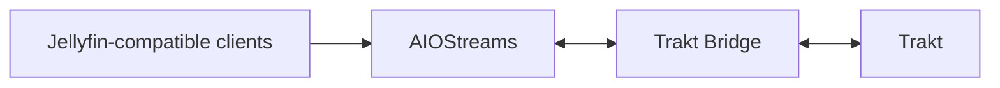

# HomeDocker Trakt Bridge

[](https://github.com/olivergiangvu/homedocker-trakt-bridge/actions/workflows/ci.yml)
[](https://github.com/olivergiangvu/homedocker-trakt-bridge/releases/latest)
[](LICENSE)

Self-hosted **Trakt sync for AIOStreams and Jellyfin-compatible clients**.

It keeps Trakt as the canonical watched/resume history while AIOStreams provides the Jellyfin-compatible playback/state surface used by clients such as Strand, Remux and Trellis.



## Features

- playback scrobbling: start, pause and stop
- watched / unwatched history sync
- resume state pulled from Trakt into AIOStreams
- movie and show watchlist sync
- bulk season/show watched updates
- retry-safe and restart-safe processing
- Trakt rate-limit protection and bounded stale fallback
- native Trakt + AIOStreams coexistence
- lightweight operator dashboard with health and sync status

## Quick start

Requirements: Docker Engine, Docker Compose, a Trakt API application and an HTTPS reverse proxy.

```bash
git clone https://github.com/olivergiangvu/homedocker-trakt-bridge.git
cd homedocker-trakt-bridge

cp .env.example .env
cp compose.example.yml compose.yml
```

Edit `.env` and set at least:

```env
PUBLIC_BASE_URL=https://trakt.example.com
TRAKT_CLIENT_ID=...
TRAKT_CLIENT_SECRET=...
BRIDGE_SECRET_KEY=...
ADMIN_KEY=...
```

Then start the bridge:

```bash
docker compose pull
docker compose up -d
```

The GHCR image is public, so anonymous pulls work without `docker login`.

For a long-lived production install, pin `TRAKT_BRIDGE_IMAGE` to a release tag or immutable digest instead of following `latest`.

Verify:

```bash
curl -fsS http://127.0.0.1:7000/health
curl -fsS http://127.0.0.1:7000/readiness
```

## Connect Trakt and AIOStreams

1. Open `https://your-domain/setup?key=<ADMIN_KEY>`.
2. Create a profile and connect Trakt through OAuth.
3. Copy the **Manifest URL** shown on the profile dashboard.
4. Add that manifest URL to AIOStreams.

Treat the manifest URL as a credential.

For clients that also use native Trakt directly, the recommended setting is:

```env
PULL_IDENTITY_MODE=trakt
```

If AIOMetadata is also part of the stack, use **Trackers = This server only** for the Jellyfin user so Trakt remains the single external watched/resume read authority.

## Documentation

- **[Getting started](docs/SETUP.md)** — install, connect Trakt and add the manifest to AIOStreams
- **[Configuration](docs/CONFIGURATION.md)** — image pinning, identity mode, freshness and reverse proxy settings
- **[Operations](docs/OPERATIONS.md)** — health, backup, update, rollback and logs
- **[Integrations](docs/INTEGRATIONS.md)** — AIOMetadata and native-Trakt coexistence
- **[Troubleshooting](docs/TROUBLESHOOTING.md)** — common sync and identity problems
- **[Documentation index](docs/README.md)** — advanced and maintainer documentation

## Contributing

Bug reports, feature requests and pull requests are welcome. See **[CONTRIBUTING.md](CONTRIBUTING.md)** before opening a change, and never include live credentials or manifest URLs in public issues.

## Security

- Keep `ADMIN_KEY`, `BRIDGE_SECRET_KEY`, Trakt OAuth material and profile manifest URLs private.
- Do not expose container port `7000` directly to the Internet.
- Terminate HTTPS at a reverse proxy and forward only to `127.0.0.1:7000`.
- Back up `.env` and `/app/data/bridge.db` together.

For sensitive vulnerabilities, follow **[SECURITY.md](SECURITY.md)** instead of opening a public issue.

## Project status

`v0.9.2` is the current public pre-1.0 release. Its published GHCR digest has passed release-workflow smoke testing and HomeDocker production cutover/restart acceptance. The remaining work toward `v1.0.0` is final burn-in, rollback verification and release packaging rather than new watch-state features.

A duplicate Trakt play-count observation is tracked separately as a non-blocking post-v1.0 investigation.

License: [MIT](LICENSE).
