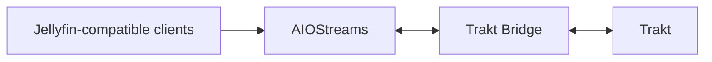

# Documentation

This is the versioned user manual for HomeDocker Trakt Bridge.

The repository and GHCR package are public. `v0.9.2` is the current published pre-1.0 release and has passed exact-digest release smoke testing plus HomeDocker production cutover/restart acceptance.

## User guides

| Guide | Use it for |
| --- | --- |
| [Setup](SETUP.md) | Install the bridge, connect Trakt and add the manifest to AIOStreams |
| [Configuration](CONFIGURATION.md) | Image version, identity mode, freshness, reverse proxy and AIOMetadata settings |
| [Operations](OPERATIONS.md) | Health checks, backups, updates, rollback and logs |
| [Integrations](INTEGRATIONS.md) | Native Trakt, AIOStreams, AIOMetadata and Jellyfin-compatible clients |
| [Troubleshooting](TROUBLESHOOTING.md) | Common sync, OAuth, rate-limit, identity and duplicate-history diagnostics |

If you are installing the bridge for the first time, start with **[Setup](SETUP.md)**.

## How the system fits together



The recommended authority model is:

```text
Trakt        = canonical watched/resume history
Trakt Bridge = sync layer
AIOStreams   = Jellyfin-compatible playback/state surface
AIOMetadata  = metadata/catalog + optional secondary-tracker write fan-out
```

## Advanced / maintainer docs

These pages are intentionally kept out of the main README because most users do not need them:

- [Architecture](ARCHITECTURE.md) — protocol boundaries and authority model
- [Development](DEVELOPMENT.md) — contributor notes, identity edge cases, tests and release engineering
- [Release acceptance records](releases/) — pre-1.0 canary, published-artifact and HomeDocker acceptance history
- [Security policy](../SECURITY.md)
- [Changelog](../CHANGELOG.md)

`/docs` is the canonical versioned documentation and changes together with the code. A GitHub Wiki can be added later for tutorials/FAQ if the public project grows, without moving release-specific or version-sensitive instructions out of the repository.
